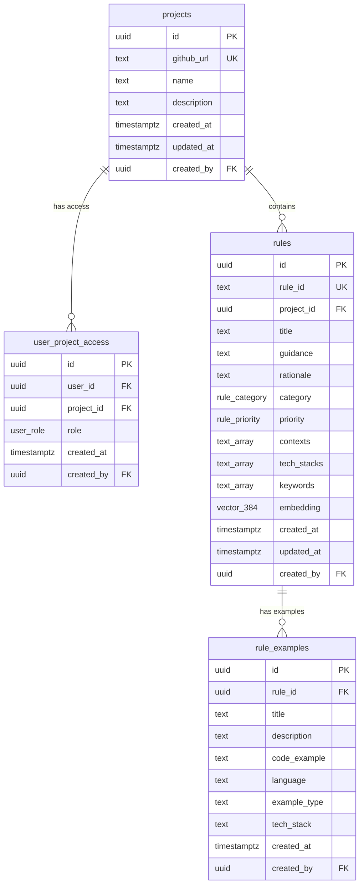

# Symmetra Database Schema

Symmetra uses PostgreSQL with pgvector for semantic rule storage and retrieval.

## Schema Overview



## Table Definitions

### projects

Stores GitHub repository information for project-scoped rules.

```sql
CREATE TABLE projects (
    id UUID PRIMARY KEY DEFAULT gen_random_uuid(),
    github_url TEXT UNIQUE NOT NULL,
    name TEXT NOT NULL,
    description TEXT,
    created_at TIMESTAMPTZ DEFAULT NOW(),
    updated_at TIMESTAMPTZ DEFAULT NOW(),
    created_by UUID REFERENCES auth.users(id) ON DELETE SET NULL,
    
    CONSTRAINT github_url_format CHECK (github_url ~ '^https://github\.com/[^/]+/[^/]+/?$')
);
```

**Indexes**:
```sql
CREATE INDEX idx_projects_github_url ON projects(github_url);
CREATE INDEX idx_projects_created_by ON projects(created_by);
```

**Example Data**:
```sql
INSERT INTO projects (github_url, name, description) VALUES
('https://github.com/aic-holdings/symmetra', 'Symmetra', 'AI-powered architectural guidance system'),
('https://github.com/company/webapp', 'WebApp', 'Main company web application');
```

### user_project_access

Manages user permissions for project-scoped rules (future RLS implementation).

```sql
CREATE TYPE user_role AS ENUM ('viewer', 'member', 'admin', 'owner');

CREATE TABLE user_project_access (
    id UUID PRIMARY KEY DEFAULT gen_random_uuid(),
    user_id UUID NOT NULL REFERENCES auth.users(id) ON DELETE CASCADE,
    project_id UUID NOT NULL REFERENCES projects(id) ON DELETE CASCADE,
    role user_role NOT NULL DEFAULT 'member',
    created_at TIMESTAMPTZ DEFAULT NOW(),
    created_by UUID REFERENCES auth.users(id) ON DELETE SET NULL,
    
    UNIQUE(user_id, project_id)
);
```

**Indexes**:
```sql
CREATE INDEX idx_user_project_access_user_id ON user_project_access(user_id);
CREATE INDEX idx_user_project_access_project_id ON user_project_access(project_id);
CREATE INDEX idx_user_project_access_role ON user_project_access(role);
```

### rules

Core table storing architectural guidance rules with vector embeddings.

```sql
CREATE TYPE rule_priority AS ENUM ('low', 'medium', 'high', 'critical');
CREATE TYPE rule_category AS ENUM ('architecture', 'security', 'performance', 'testing', 'ai-ml', 'ux', 'devops', 'data');

CREATE TABLE rules (
    id UUID PRIMARY KEY DEFAULT gen_random_uuid(),
    rule_id TEXT UNIQUE NOT NULL,
    project_id UUID REFERENCES projects(id) ON DELETE CASCADE,
    
    -- Rule content
    title TEXT NOT NULL,
    guidance TEXT NOT NULL,
    rationale TEXT,
    
    -- Classification
    category rule_category NOT NULL,
    priority rule_priority NOT NULL DEFAULT 'medium',
    
    -- Context targeting
    contexts TEXT[] DEFAULT '{}',
    tech_stacks TEXT[] DEFAULT '{}',
    keywords TEXT[] DEFAULT '{}',
    
    -- Vector embedding for semantic search (384 dimensions for all-MiniLM-L6-v2)
    embedding VECTOR(384),
    
    -- Metadata
    created_at TIMESTAMPTZ DEFAULT NOW(),
    updated_at TIMESTAMPTZ DEFAULT NOW(),
    created_by UUID REFERENCES auth.users(id) ON DELETE SET NULL,
    
    -- Validation constraints
    CONSTRAINT rule_id_format CHECK (rule_id ~ '^[a-z0-9-]+$'),
    CONSTRAINT contexts_not_empty CHECK (array_length(contexts, 1) > 0),
    CONSTRAINT title_not_empty CHECK (length(trim(title)) > 0),
    CONSTRAINT guidance_not_empty CHECK (length(trim(guidance)) > 0)
);
```

**Indexes**:
```sql
-- Performance indexes
CREATE INDEX idx_rules_project_id ON rules(project_id);
CREATE INDEX idx_rules_category ON rules(category);
CREATE INDEX idx_rules_priority ON rules(priority);
CREATE INDEX idx_rules_rule_id ON rules(rule_id);

-- GIN indexes for array columns
CREATE INDEX idx_rules_contexts ON rules USING GIN(contexts);
CREATE INDEX idx_rules_tech_stacks ON rules USING GIN(tech_stacks);
CREATE INDEX idx_rules_keywords ON rules USING GIN(keywords);

-- Vector similarity index for semantic search
CREATE INDEX idx_rules_embedding 
ON rules USING ivfflat (embedding vector_cosine_ops) 
WITH (lists = 100);
```

**Example Data**:
```sql
INSERT INTO rules (rule_id, title, guidance, category, priority, contexts, tech_stacks, keywords) VALUES
('vector-db-choice', 'Vector Database Selection', 
 '🗄️ For vector storage, choose: ChromaDB (development), Weaviate (production), or pgvector (PostgreSQL integration)',
 'architecture', 'high',
 ARRAY['ide-assistant', 'agent'],
 ARRAY['python', 'ai', 'database'],
 ARRAY['vector', 'database', 'embedding', 'storage']);
```

### rule_examples

Stores code examples and implementation patterns for rules.

```sql
CREATE TABLE rule_examples (
    id UUID PRIMARY KEY DEFAULT gen_random_uuid(),
    rule_id UUID NOT NULL REFERENCES rules(id) ON DELETE CASCADE,
    
    -- Example content
    title TEXT NOT NULL,
    description TEXT,
    code_example TEXT,
    language TEXT,
    
    -- Example type and context
    example_type TEXT DEFAULT 'good' CHECK (example_type IN ('good', 'bad', 'before', 'after')),
    tech_stack TEXT,
    
    -- Metadata
    created_at TIMESTAMPTZ DEFAULT NOW(),
    created_by UUID REFERENCES auth.users(id) ON DELETE SET NULL,
    
    CONSTRAINT title_not_empty CHECK (length(trim(title)) > 0)
);
```

**Indexes**:
```sql
CREATE INDEX idx_rule_examples_rule_id ON rule_examples(rule_id);
CREATE INDEX idx_rule_examples_language ON rule_examples(language);
CREATE INDEX idx_rule_examples_tech_stack ON rule_examples(tech_stack);
CREATE INDEX idx_rule_examples_type ON rule_examples(example_type);
```

## Common Queries

### Vector Similarity Search

Find semantically similar rules using cosine distance:

```sql
WITH query_embedding AS (
  SELECT '[0.1, 0.2, ...]'::vector AS embedding  -- Replace with actual embedding
)
SELECT 
  rule_id,
  title,
  guidance,
  category,
  priority,
  1 - (embedding <=> query_embedding.embedding) AS similarity
FROM rules, query_embedding
WHERE 
  embedding IS NOT NULL
  AND (project_id IS NULL OR project_id = $1)  -- Global or project-specific rules
ORDER BY embedding <=> query_embedding.embedding
LIMIT 10;
```

### Project-Scoped Rule Retrieval

Get rules available for a specific project:

```sql
SELECT r.rule_id, r.title, r.guidance, r.category, r.priority
FROM rules r
WHERE 
  r.project_id IS NULL  -- Global rules
  OR r.project_id = $1  -- Project-specific rules
ORDER BY 
  r.project_id NULLS LAST,  -- Project rules override global
  r.priority DESC,
  r.created_at DESC;
```

### Rule Search by Keywords

Search rules using keyword matching:

```sql
SELECT 
  rule_id,
  title,
  guidance,
  category,
  (
    CASE WHEN title ILIKE '%' || $1 || '%' THEN 3 ELSE 0 END +
    CASE WHEN guidance ILIKE '%' || $1 || '%' THEN 2 ELSE 0 END +
    CASE WHEN array_to_string(keywords, ' ') ILIKE '%' || $1 || '%' THEN 1 ELSE 0 END
  ) AS search_score
FROM rules
WHERE 
  title ILIKE '%' || $1 || '%'
  OR guidance ILIKE '%' || $1 || '%' 
  OR array_to_string(keywords, ' ') ILIKE '%' || $1 || '%'
ORDER BY search_score DESC, priority DESC
LIMIT 20;
```

### Context-Filtered Rules

Get rules for specific contexts:

```sql
SELECT rule_id, title, guidance, category
FROM rules
WHERE 
  $1 = ANY(contexts)  -- e.g., 'ide-assistant'
  AND (project_id IS NULL OR project_id = $2)
ORDER BY priority DESC, created_at DESC;
```

## Vector Operations

### Embedding Generation

Generate embeddings using sentence-transformers:

```python
from sentence_transformers import SentenceTransformer

model = SentenceTransformer('all-MiniLM-L6-v2')
text = f"{rule['title']} {rule['guidance']} {rule.get('rationale', '')}"
embedding = model.encode(text).tolist()

# Update database
cursor.execute(
    "UPDATE rules SET embedding = %s WHERE id = %s",
    (embedding, rule['id'])
)
```

### Similarity Search with Filtering

```sql
-- Find similar rules with context and tech stack filtering
WITH query_embedding AS (
  SELECT %s::vector AS embedding
)
SELECT 
  r.rule_id,
  r.title,
  r.guidance,
  r.category,
  r.priority,
  1 - (r.embedding <=> q.embedding) AS similarity
FROM rules r, query_embedding q
WHERE 
  r.embedding IS NOT NULL
  AND (r.project_id IS NULL OR r.project_id = %s)
  AND (%s = ANY(r.contexts) OR %s IS NULL)
  AND (r.tech_stacks && %s OR %s IS NULL)
ORDER BY r.embedding <=> q.embedding
LIMIT %s;
```

## Performance Tuning

### Vector Index Optimization

```sql
-- Tune vector index parameters
DROP INDEX IF EXISTS idx_rules_embedding;
CREATE INDEX idx_rules_embedding ON rules 
USING ivfflat (embedding vector_cosine_ops) 
WITH (lists = 100);  -- Adjust based on data size

-- Analyze query performance
EXPLAIN ANALYZE 
SELECT * FROM rules 
ORDER BY embedding <=> '[0.1,0.2,...]'::vector 
LIMIT 10;
```

### Query Optimization

```sql
-- Add partial indexes for common queries
CREATE INDEX idx_rules_global ON rules(category, priority) 
WHERE project_id IS NULL;

CREATE INDEX idx_rules_context_ide ON rules(priority) 
WHERE 'ide-assistant' = ANY(contexts);

-- Update statistics
ANALYZE rules;
```

## Triggers and Functions

### Updated At Trigger

```sql
CREATE OR REPLACE FUNCTION update_updated_at_column()
RETURNS TRIGGER AS $$
BEGIN
    NEW.updated_at = NOW();
    RETURN NEW;
END;
$$ language 'plpgsql';

CREATE TRIGGER update_rules_updated_at 
    BEFORE UPDATE ON rules 
    FOR EACH ROW 
    EXECUTE FUNCTION update_updated_at_column();
```

## Migration Strategy

### Schema Versioning

```sql
-- Track schema version
CREATE TABLE IF NOT EXISTS schema_version (
    version INTEGER PRIMARY KEY,
    applied_at TIMESTAMPTZ DEFAULT NOW()
);

INSERT INTO schema_version (version) VALUES (1);
```

### Adding New Embedding Models

```sql
-- Add support for different embedding dimensions
ALTER TABLE rules ADD COLUMN embedding_model TEXT DEFAULT 'all-MiniLM-L6-v2';
ALTER TABLE rules ADD COLUMN embedding_768 VECTOR(768);  -- For all-mpnet-base-v2

-- Create index for new embeddings
CREATE INDEX idx_rules_embedding_768 ON rules 
USING ivfflat (embedding_768 vector_cosine_ops) 
WITH (lists = 100);
```

## Backup and Recovery

### Full Database Backup

```bash
# Backup entire database
pg_dump -h db.kkvkwxfirmeywhvndjaa.supabase.co \
  -U postgres \
  -d postgres \
  --no-password \
  -f symmetra_backup.sql

# Restore from backup
psql -h localhost -U postgres -d symmetra < symmetra_backup.sql
```

### Rules-Only Backup

```sql
-- Export rules as JSON
COPY (
  SELECT json_agg(
    json_build_object(
      'rule_id', rule_id,
      'title', title,
      'guidance', guidance,
      'category', category,
      'priority', priority,
      'contexts', contexts,
      'tech_stacks', tech_stacks,
      'keywords', keywords
    )
  )
  FROM rules 
  WHERE project_id IS NULL
) TO '/tmp/global_rules.json';
```