# System Data Flow

This document details the complete data flow when a user interacts with Symmetra's guidance system.

## Overview

Symmetra uses **AI-first architecture** with vector search to provide team-specific architectural guidance. Instead of hardcoded rules, it retrieves relevant patterns from a vector database and synthesizes them into contextual advice.

## Complete Data Flow

```mermaid
graph TD
    %% User Input
    User[👤 Developer] -->|"create user authentication system"| ClaudeCode[🤖 Claude Code]
    
    %% MCP Layer
    ClaudeCode -->|MCP Tool Call| MCPServer[📡 Symmetra MCP Server<br/>server.py]
    MCPServer -->|capture_guidance()| GuidanceManager[🧠 Guidance Manager<br/>guidance_manager.py]
    
    %% Decision Points
    GuidanceManager -->|Check operation| Operation{Operation Type?}
    
    %% Capture Path
    Operation -->|Capture| CaptureFlow[💬 Conversational Capture]
    CaptureFlow -->|1. Extract context| ContextExtractor[🔍 Context Extractor]
    ContextExtractor -->|2. Generate prompts| ConversationEngine[💭 Conversation Engine]
    ConversationEngine -->|3. Refine guidance| RefinedGuidance[📝 Refined Guidance]
    
    %% Vector Processing
    RefinedGuidance -->|4. Generate embeddings| EmbeddingEngine[🎯 OpenAI Embeddings<br/>text-embedding-3-small]
    EmbeddingEngine -->|5. Store with metadata| VectorDB[(🗄️ Supabase + pgvector<br/>guidance table)]
    
    %% Search Path
    Operation -->|Search| SearchFlow[🔍 Vector Search]
    SearchFlow -->|1. Query embedding| EmbeddingEngine
    EmbeddingEngine -->|2. Semantic search| VectorDB
    VectorDB -->|3. Return matches| SearchResults[📋 Relevant Patterns]
    
    %% Response Assembly
    VectorDB -->|Success| ResponseBuilder[📦 Response Builder]
    SearchResults -->|Format results| ResponseBuilder
    ResponseBuilder -->|Structured response| MCPServer
    MCPServer -->|MCP Response| ClaudeCode
    ClaudeCode -->|Natural language| User
    
    %% Styling
    classDef userClass fill:#e1f5fe,stroke:#01579b,stroke-width:2px
    classDef aiClass fill:#f3e5f5,stroke:#4a148c,stroke-width:2px
    classDef dataClass fill:#e8f5e8,stroke:#1b5e20,stroke-width:2px
    classDef processClass fill:#fff3e0,stroke:#e65100,stroke-width:2px
    
    class User,ClaudeCode userClass
    class GuidanceManager,ConversationEngine,EmbeddingEngine aiClass
    class VectorDB,SearchResults,RefinedGuidance dataClass
    class MCPServer,CaptureFlow,SearchFlow processClass
```

## Detailed Flow Steps

### 1. User Interaction

```mermaid
sequenceDiagram
    participant User as 👤 Developer
    participant Claude as 🤖 Claude Code
    participant MCP as 📡 MCP Server
    
    User->>Claude: "Save this auth pattern!"
    Claude->>MCP: capture_guidance(description, context)
    MCP->>Claude: Conversational prompts
    Claude->>User: "What should we call this pattern?"
    User->>Claude: "JWT with refresh tokens"
    Claude->>MCP: refine_guidance(title, details)
    MCP->>Claude: Pattern saved successfully
    Claude->>User: "Pattern captured and ready for search!"
```


### 2. Embedding Generation Process

The system uses **OpenAI's text-embedding-3-small** model for semantic understanding:

```mermaid
graph LR
    A[📝 Raw Text] -->|1. Preprocessing| B[🧹 Clean Text]
    B -->|2. Tokenization| C[🔤 Tokens]
    C -->|3. OpenAI API| D[🎯 384D Vector]
    D -->|4. Normalization| E[📊 Unit Vector]
    E -->|5. Storage| F[(🗄️ pgvector)]
    
    style D fill:#f9f9f9,stroke:#333,stroke-width:2px
```



**Embedding Properties:**
- **Dimensions**: 384 (optimized for speed and storage)
- **Model**: text-embedding-3-small
- **Context Length**: 8,191 tokens
- **Similarity Metric**: Cosine similarity

### 3. Vector Search Process

```mermaid
graph TD
    Query[🔍 Search Query] -->|1. Embed query| QueryVector[📊 Query Vector]
    QueryVector -->|2. Similarity search| VectorDB[(🗄️ Vector Database)]
    VectorDB -->|3. Cosine similarity| Matches[📋 Similar Patterns]
    
    Matches -->|4. Score filtering| ScoreFilter{Similarity > 0.7?}
    ScoreFilter -->|✅ Yes| RelevantResults[🎯 Relevant Results]
    ScoreFilter -->|❌ No| FallbackSearch[🔄 Broader Search]
    
    RelevantResults -->|5. Ranking| RankedResults[📊 Ranked by Relevance]
    FallbackSearch -->|Lower threshold| RankedResults
    
    RankedResults -->|6. Context filtering| ContextFilter[🏷️ Filter by Context]
    ContextFilter -->|7. Final results| FinalResults[✨ Final Results]
```



### 4. Context-Aware Filtering

Symmetra applies multiple layers of context filtering:

```mermaid
graph LR
    Raw[📊 Vector Results] -->|Tech Stack| TechFilter[⚙️ Tech Filter]
    TechFilter -->|Project Type| ProjectFilter[🏗️ Project Filter]
    ProjectFilter -->|Complexity| ComplexityFilter[📈 Complexity Filter]
    ComplexityFilter -->|Recency| RecencyFilter[⏰ Recency Filter]
    RecencyFilter -->|Final Ranking| Final[🎯 Contextual Results]
    
    style Final fill:#e8f5e8,stroke:#2e7d32,stroke-width:3px
```



**Context Factors:**
- **Technology Stack**: React, Node.js, Python, etc.
- **Project Type**: API, Web App, CLI, etc.
- **Team Size**: Individual, Small Team, Enterprise
- **Complexity Level**: Simple, Intermediate, Advanced

## Performance Characteristics

### Embedding Generation
- **Latency**: ~100-300ms per guidance item
- **Cost**: ~$0.00002 per 1K tokens
- **Rate Limits**: 3000 RPM (requests per minute)

### Vector Search
- **Query Time**: <50ms for most searches
- **Scalability**: Handles 100K+ patterns efficiently
- **Memory Usage**: ~1.5MB per 1000 patterns

### Storage Requirements


## Error Handling & Fallbacks

```mermaid
graph TD
    Request[📥 User Request] --> EmbeddingCheck{Embedding Available?}
    
    EmbeddingCheck -->|✅ Yes| VectorSearch[🔍 Vector Search]
    EmbeddingCheck -->|❌ No| KeywordFallback[🔤 Keyword Fallback]
    
    VectorSearch --> ResultsCheck{Results Found?}
    ResultsCheck -->|✅ Yes| Success[✅ Return Results]
    ResultsCheck -->|❌ No| KeywordFallback
    
    KeywordFallback --> BasicResults[📝 Basic Matching]
    BasicResults --> Success
    
    Success --> Cache[💾 Cache Results]
    
    style Success fill:#e8f5e8,stroke:#2e7d32,stroke-width:2px
    style KeywordFallback fill:#fff3e0,stroke:#f57c00,stroke-width:2px
```



## Monitoring & Observability

Symmetra includes comprehensive monitoring:

```mermaid
graph LR
    System[🖥️ Symmetra] -->|Metrics| Prometheus[📊 Prometheus]
    System -->|Logs| Structured[📋 Structured Logs]
    System -->|Traces| OpenTelemetry[🔍 OpenTelemetry]
    
    Prometheus --> Grafana[📈 Grafana Dashboard]
    Structured --> LogAnalysis[🔎 Log Analysis]
    OpenTelemetry --> Jaeger[🕸️ Distributed Tracing]
```



**Key Metrics:**
- Request latency (p50, p95, p99)
- Embedding generation time
- Vector search performance
- Cache hit rates
- Error rates by operation type

---

This architecture enables Symmetra to provide **sub-second response times** while maintaining **high accuracy** and **contextual relevance** in its guidance recommendations.