# Symmetra Documentation

<div align="center">
  
  <p><strong>Production-ready architectural patterns at the speed of thought</strong></p>
</div>

!!! tip "🚀 Quick Start"
    New to Symmetra? Jump straight to the [Quick Start Guide](getting-started/quickstart.md) to get up and running in 5 minutes.

## What is Symmetra?

Symmetra is a **conversational guidance capture system** that enables developers to capture architectural patterns directly from their codebase through natural conversation with Claude Code. Instead of manually documenting patterns after the fact, you can capture them in the moment and make them instantly searchable for your entire team.

### Key Innovation

Say **"This error handling pattern is clean - let's add it as guidance!"** and Symmetra will help you capture, refine, and make it searchable for future use.

```mermaid
graph LR
    A[👤 Developer] -->|"Save this pattern!"| B[🤖 Claude Code + Symmetra]
    B -->|Conversational refinement| C[📝 Structured Guidance]
    C -->|Vector embeddings| D[🔍 Searchable Knowledge]
    D -->|Future queries| E[⚡ Instant Retrieval]
    E --> A
```



## Core Features

### 🗣️ Conversational Capture
- **Zero context switching** - Capture patterns without leaving your workflow
- **Natural language interface** - Describe patterns in your own words
- **Intelligent refinement** - Conversational prompts improve guidance quality

### ⚡ Instant Search
- **Vector-powered search** - Semantic search using OpenAI embeddings
- **Context-aware results** - Patterns adapt to your current project and tech stack
- **Instant availability** - Captured patterns are immediately searchable

### 🤖 AI-Native Integration
- **Claude Code integration** - Seamless integration with your coding assistant
- **MCP protocol** - Works with any MCP-compatible AI assistant
- **Project-aware** - Guidance is tied to specific projects and contexts

### 🔍 Comprehensive Analysis
- **Code quality detection** - Security, maintainability, and architectural concerns
- **Multiple report formats** - Optimized for different use cases and contexts
- **Hybrid analysis** - Combines pattern matching, AST analysis, and contextual understanding

## Architecture Overview

Symmetra creates a **self-improving development loop** where discovering good patterns immediately benefits your entire team:

```mermaid
graph TD
    A[💻 Code Development] --> B[🔍 Pattern Discovery]
    B --> C[💬 Conversational Capture]
    C --> D[📊 Vector Storage]
    D --> E[🔎 Semantic Search]
    E --> F[📚 Team Knowledge]
    F --> A
    
    style A fill:#e1f5fe
    style C fill:#f3e5f5
    style E fill:#e8f5e8
```



This represents a fundamental shift from **"document after the fact"** to **"capture in the moment"** knowledge management.

## Getting Started

<div class="grid cards" markdown>

-   :material-clock-fast:{ .lg .middle } __Quick Start__

    ---

    Get Symmetra running in 5 minutes

    [:octicons-arrow-right-24: Quick Start](getting-started/quickstart.md)

-   :material-cog-outline:{ .lg .middle } __Installation__

    ---

    Detailed installation and setup guide

    [:octicons-arrow-right-24: Installation](getting-started/installation.md)

-   :material-puzzle-outline:{ .lg .middle } __Integrations__

    ---

    Connect with Claude Code and other MCP clients

    [:octicons-arrow-right-24: Integrations](integrations/index.md)

-   :material-api:{ .lg .middle } __API Reference__

    ---

    Complete API documentation and examples

    [:octicons-arrow-right-24: API Reference](api/index.md)

</div>

## Use Cases

### For Individual Developers
- **Pattern Recognition**: Capture clean implementations as you discover them
- **Knowledge Building**: Build your personal library of proven patterns
- **Consistency**: Maintain consistent approaches across projects

### For Development Teams
- **Knowledge Sharing**: Team patterns become instantly available to everyone
- **Onboarding**: New team members get access to team-specific patterns
- **Standards**: Organically develop and maintain coding standards

### for AI Assistants
- **Context-Aware Guidance**: Get project-specific architectural advice
- **Pattern Library**: Access to battle-tested implementations
- **Continuous Learning**: System improves as patterns are captured

## Example Patterns

!!! example "Common Captured Patterns"

    === "Error Handling"

        ```typescript
        // Structured error handling with logging
        try {
          const result = await riskyOperation();
          logger.info('Operation successful', { operationId, result });
          return result;
        } catch (error) {
          logger.error('Operation failed', { 
            operationId, 
            error: error.message,
            stack: error.stack 
          });
          throw new AppError('Operation failed', 500, error);
        }
        ```

    === "API Design"

        ```typescript
        // RESTful endpoint with validation
        export async function POST(request: Request) {
          try {
            const body = await request.json();
            const validated = apiSchema.parse(body);
            
            const result = await service.create(validated);
            
            return NextResponse.json(
              { data: result, success: true },
              { status: 201 }
            );
          } catch (error) {
            return handleApiError(error);
          }
        }
        ```

    === "Database Patterns"

        ```typescript
        // Type-safe database operations with Drizzle ORM
        export async function getUserWithPosts(userId: string) {
          return await db
            .select()
            .from(users)
            .leftJoin(posts, eq(posts.authorId, users.id))
            .where(eq(users.id, userId))
            .groupBy(users.id);
        }
        ```

## Community & Support

<div class="grid cards" markdown>

-   :material-github:{ .lg .middle } __GitHub__

    ---

    Source code, issues, and contributions

    [:octicons-arrow-right-24: GitHub Repository](https://github.com/aic-holdings/symmetra)

-   :material-chat:{ .lg .middle } __Community__

    ---

    Get help and connect with other users

    [:octicons-arrow-right-24: Join Community](support/community.md)

-   :material-help-circle:{ .lg .middle } __Support__

    ---

    FAQ and troubleshooting guides

    [:octicons-arrow-right-24: Get Support](support/faq.md)

-   :material-book-open:{ .lg .middle } __Examples__

    ---

    Real-world patterns and implementations

    [:octicons-arrow-right-24: Browse Examples](examples/index.md)

</div>

---

<div align="center">
  <p><em>Symmetra - Making architectural knowledge as natural as having a conversation</em></p>
</div>