# Quick Start

Get Symmetra running in **5 minutes** and start capturing architectural patterns immediately.

!!! info "Prerequisites"
    - Python 3.8 or higher
    - Claude Code (recommended) or any MCP-compatible AI assistant
    - OpenAI API key for embeddings

## Installation

=== "Using uvx (Recommended)"

    The fastest way to try Symmetra without installation:

    ```bash
    # Run directly without installation
    uvx --from git+https://github.com/aic-holdings/symmetra symmetra --help
    ```

=== "Local Development"

    For development and customization:

    ```bash
    # Clone and install with uv
    git clone https://github.com/aic-holdings/symmetra
    cd symmetra
    uv run symmetra --help

    # Or with pip
    pip install -e .
    symmetra --help
    ```

=== "Docker (Experimental)"

    For containerized deployment:

    ```bash
    docker run --rm -i --network host \
      -v "$(pwd)":/workspace \
      ghcr.io/aic-holdings/symmetra:latest \
      symmetra check
    ```

## Claude Code Integration

Add Symmetra to your Claude Code MCP settings:

```json title="~/.config/claude-code/mcp_servers.json"
{
  "mcpServers": {
    "symmetra": {
      "command": "symmetra",
      "args": ["server"],
      "env": {
        "OPENAI_API_KEY": "your-openai-api-key-here"
      }
    }
  }
}
```

!!! tip "Project-Specific Configuration"
    For project-specific settings, create `.symmetra.toml` in your project root:

    ```toml title=".symmetra.toml"
    [project]
    name = "my-awesome-project"

    [api]
    openai_api_key = "sk-your-api-key-here"

    [rules]
    max_file_lines = 300
    complexity_threshold = "medium"
    ```

## First Capture

Once integrated, you can immediately start capturing patterns:

1. **Discover a Pattern**: While coding, notice a clean implementation
2. **Start Capture**: Say to Claude Code:
   ```
   "This error handling pattern is clean - let's add it as guidance!"
   ```
3. **Conversational Refinement**: Symmetra will ask questions to improve the guidance:
   - What would you like to call this pattern?
   - What category does this belong to?
   - What tech stack is this for?

4. **Instant Availability**: The pattern is immediately searchable:
   ```
   "Show me error handling patterns for API endpoints"
   ```

## Example Workflow

Here's a complete example of capturing and using a pattern:

```mermaid
sequenceDiagram
    participant Dev as 👤 Developer
    participant CC as 🤖 Claude Code
    participant Sym as 🧠 Symmetra
    participant DB as 🗄️ Database

    Dev->>CC: "This auth pattern is solid - save it!"
    CC->>Sym: capture_guidance()
    Sym->>Dev: "What should we call this pattern?"
    Dev->>Sym: "JWT authentication with refresh tokens"
    Sym->>Sym: Generate embeddings
    Sym->>DB: Store pattern with vectors
    
    Note over Dev,DB: Later...
    
    Dev->>CC: "How should I handle auth in my API?"
    CC->>Sym: search_guidance("auth API")
    Sym->>DB: Vector search
    DB->>Sym: Return relevant patterns
    Sym->>CC: "Here's your team's JWT pattern..."
    CC->>Dev: Complete implementation example
```



## Available Tools

Once integrated, you'll have access to these MCP tools:

| Tool | Purpose | Example Usage |
|------|---------|---------------|
| `capture_guidance()` | Capture new patterns | "Save this validation pattern" |
| `search_guidance()` | Find existing patterns | "Show me auth patterns" |
| `refine_guidance()` | Improve existing guidance | "Update the error handling guide" |
| `detect_issues()` | Analyze code quality | "Check this file for issues" |

## Verification

To verify everything is working:

1. **Check MCP Connection**:
   ```
   Ask Claude Code: "Can you see Symmetra tools?"
   ```

2. **Test Pattern Search**:
   ```
   Ask Claude Code: "Search for any existing guidance patterns"
   ```

3. **Capture Your First Pattern**:
   ```
   "Let's capture this function as a guidance pattern"
   ```

## Next Steps

<div class="grid cards" markdown>

-   :material-account-group:{ .lg .middle } __User Guide__

    ---

    Learn advanced capture techniques and best practices

    [:octicons-arrow-right-24: User Guide](../user-guide/index.md)

-   :material-puzzle-outline:{ .lg .middle } __Integration Details__

    ---

    Detailed setup for different MCP clients

    [:octicons-arrow-right-24: Integrations](../integrations/index.md)

-   :material-cog:{ .lg .middle } __Configuration__

    ---

    Customize Symmetra for your workflow

    [:octicons-arrow-right-24: Configuration](configuration.md)

-   :material-book-open:{ .lg .middle } __Examples__

    ---

    Explore real-world pattern examples

    [:octicons-arrow-right-24: Examples](../examples/index.md)

</div>

## Troubleshooting

!!! question "Common Issues"

    === "Tools Not Available"
        
        **Symptom**: Claude Code doesn't see Symmetra tools
        
        **Solution**:
        1. Restart Claude Code
        2. Check MCP configuration syntax
        3. Verify Symmetra is installed: `symmetra --version`

    === "OpenAI API Errors"
        
        **Symptom**: Embedding generation fails
        
        **Solution**:
        1. Verify API key is correct
        2. Check API quota and usage
        3. Ensure key has proper permissions

    === "Database Connection"
        
        **Symptom**: Can't store or search patterns
        
        **Solution**:
        1. Check internet connection (uses hosted Supabase)
        2. Try with debug mode: `symmetra server --log-level DEBUG`

Need more help? Check the [full troubleshooting guide](../support/troubleshooting.md) or [join our community](../support/community.md).

---

!!! success "You're Ready!"
    Congratulations! You now have Symmetra running and can start building your team's architectural knowledge base through natural conversation.